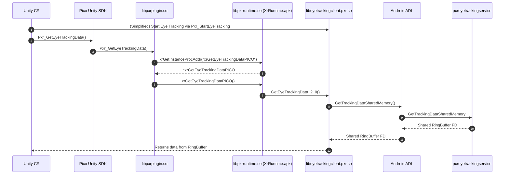

# Face & eye trackng
This file contains documentation for the eye and face tracking aspect of the PICO 4 P/E.

The libraries that are responsible for it's tracking:
- `/system/lib/libeyetrackingclient.pxr.so`
  - Binder IPC listener implementation.
- `/system/lib/libpxreyetrackingservice.pxr.so`
  - Binder IPC server, controls LEDs and fetches data from `libpxreyetracking.phoenix.so`.
- `/system/lib/libpxreyetracking.phoenix.so`
  - Actually gets the eye and face tracking data (the Qualcomm Neural Processing SDK) and puts it into a buffer using OpenCL shared memory.
## From SDK to service
Pico provides a way to get face and eye tracking, among other API's via their Unity SDK, Unreal Engine SDK or OpenXR runtime.

Below is an example illustration of how this data flows from the eye tracking service to the actual application, this applies to most Pico XR API's.

Pico makes use of IPC AIDL binders, "services". Which are documented here: [services](/services/README.md).
## Hardware
As described in [devices](/devices/README.md), the Pico 4 P/E make use of 3x [Omnivision OV6211](https://www.ovt.com/products/ov6211/) IR camera's, which are then combined into one "physical camera" via the [Omnivision OV680](https://www.ovt.com/products/ov680/).

The eye and face LED's are controlled via the [Awinic AW21009](https://www.awinic.com/en/productDetail/AW21009QNR). And are enabled / disabled via GPIO pins.
Device attribute paths:
- `/sys/bus/i2c/drivers/aw210xx_led/2-0020/leds/aw210xx_led/reg` for the AW21009 registers. 
  Format: `REG VALUE`.
- `/sys/bus/i2c/drivers/aw210xx_led/2-0020/leds/aw210xx_led/hwen` for the GPIO hardware enable bits. 
  Write `1` to enable, `2` to disable the LED GPIO, `3` to disable the GPIO for the AW21009 chip.

This camera is exposed as physical camera `5` via the Android CameraService with the following parameters:
- Width: 400
- Height: 1600
- Format: RAW_PRIVATE
The camera is however, rotated 90 degrees, the actual output:
- Height: 1600
- Width: 400
- Format: Y8
- ISO: 100

Default LED settings:
- Face: 64 mA (0x40)
- Eyes: 16 mA (0x10)
## Algorithm
The ET/FT algorithm works as a machine learning model. The model parameters are encrypted and available at `/system/etc/pxr/avatar/`.
These models are SNPE models ran via the Qualcomm Neural Processing SDK.